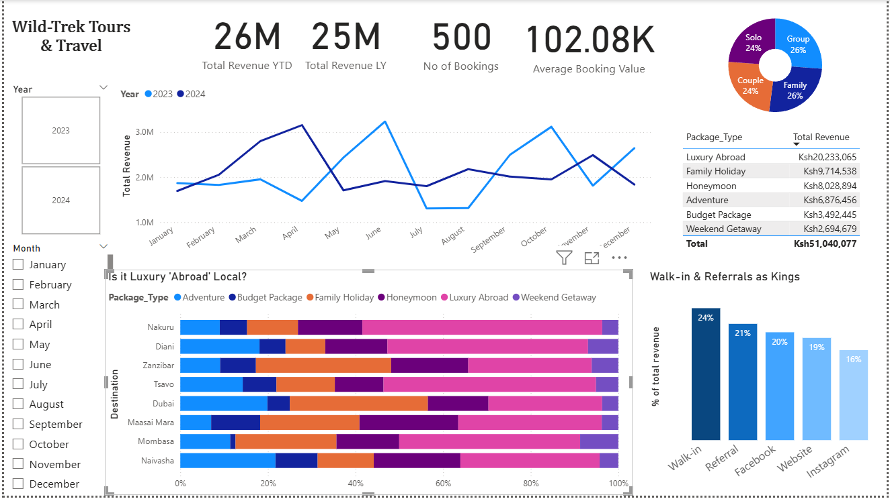

# Power-BI-tourism-dashboard
Power BI project analyzing the tourism industry using synthetic data, focusing on DAX measures, visual storytelling, and dashboard design.

# Project Overview
This project is a Power BI dashboard built to analyze the performance of a fictional Tours & Travel company.
The goal was to practice data analysis skills, DAX measures, and visual storytelling using a simulated dataset.
Note: The data is artificially generated and does not reflect real business performance. It’s designed for learning and demonstration purposes.

# Dashboard highlights
1. Revenue Trends : This visual shows monthly revenue parttens, compairing total Revenue YTD with Total Revenue LY.
2. Booking Performance : The total number of bookings made and the average revenue generated per bookings.
3. Customer Segments : Revenue breakdown from different groups of customers - groups, solo, couples and family.
4. Travel packages : Perfomance of different travel packages
5. Destinations : Popular destinations generating higher revenue, distributed per package type.
6. Channel contributions: Marketing channels analysis, which channel contibutes the most to the total revenue.

# Key Insights
Groups and family contribute more to the total revenue, this implies that package deals are good and attractive. Solo travellers are the least, one could check package for solo trips, however, could also imply people like to travel in company and not alone, thus focus on group deals to boost revenue.
Local destinations performed well compared to international trips, however, average booking value for international trips is still high, thus boosts profit margin.
Quarter 4 and Quarter 1 have revenue spikes. 

# Learning takeways 
Practiced Dax in creating measures.
Dashboards layouts and data story telling using visuals.
Strengthened ability to approach an end-to-end analytics project

